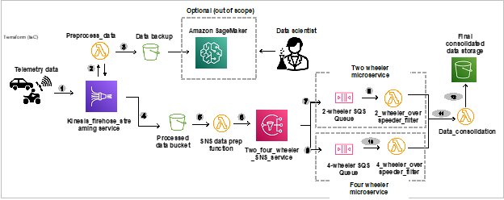

# Vehicle Telematics AWS Architecture

This architecture is designed to process and analyze real-time data from vehicle telematics sensors in order to identify overspeeding two-wheeler and four-wheeler vehicles. It uses a combination of AWS services, including Amazon Kinesis Firehose, AWS Lambda, Amazon Simple Notification Service (SNS), Amazon Simple Queue Service (SQS), and Amazon S3, to build a scalable and fault-tolerant system.




## Prerequisites:

- AWS Account
- IAM User with Access Key & Secret Key
- Docker

## Running the project

### 1. Setup:

- Clone this repository
- Provide the access key, secret key and region as requested in *variable.tf* and *config.py*
- change number of records of vehicle data in config.py if necessary [default to *100*]

### 2. Build the Docker image:

```bash
docker build -t telematics:terraform .
```

### 3. Send data to infrastructure
1. Run the Docker image by 
```bash
docker run --name telematicscontainer telematics:terraform
```
2. Check infratsructure on your cloud
3. After 5-10 minutes check data in S3 buckets


**Please note:** Extra **costs** may incur depending on the usage and account type.


### Troubleshooting
#### Known issue
- Only occurs while **recreating** architecute, *already existing mapping error* pops up
- terraform fails to delete the existing sqs and lambda mapping with *terraform destroy* command

#### How to fix
1. Log in to the console using: https://aws.amazon.com/console/
2. Search for CloudShell in search bar and click on the CloudShell service.
3. Check the existing mapping *aws lambda list-event-source-mappings* 
4. Copy the uuid  
5. Delete the uuid like *aws lambda delete-event-source-mapping --uuid 3b1b0cb3-ad79-46e4-be1c-a4d157eaafdc*
6. Repeat for other uuid

## License

This project is licensed under the [MIT](https://choosealicense.com/licenses/mit/) License.

